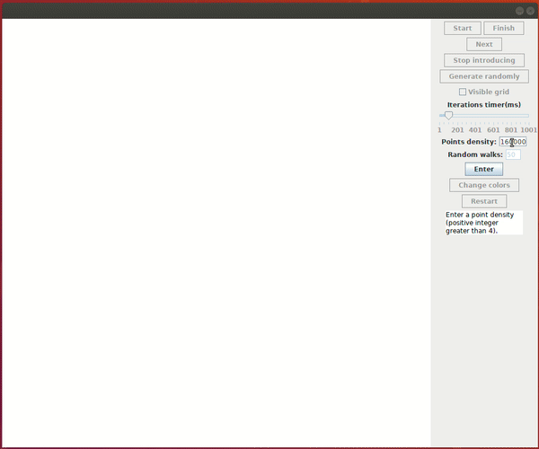
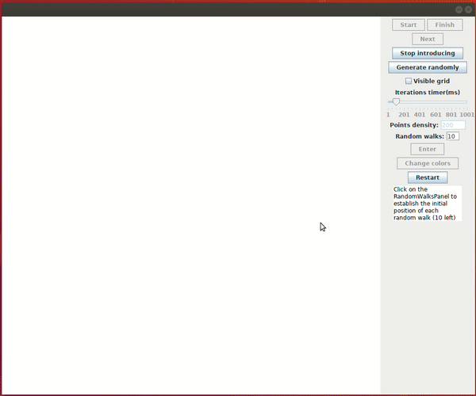
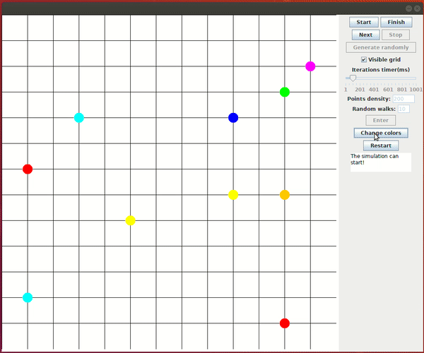
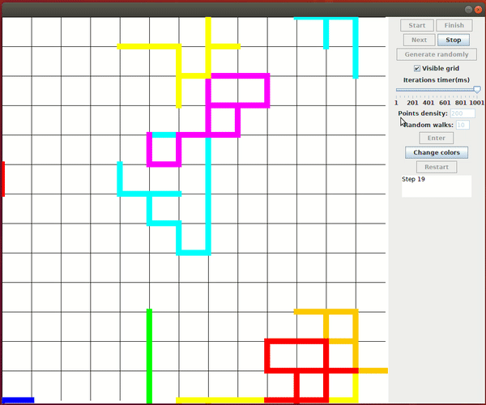
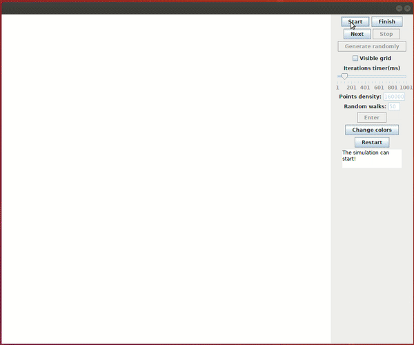

# Random Walks

A random walk is a mathematical object, known as a stochastic or random process, that describes a path that consists of a succession of random steps on some mathematical space such as the integers.  
This Java program simulates the behaviour of several random walks.


## Program features

* There is a small text area where some messages will be displayed.

* First of all, the amount of points of the bidimensional space where the random walks will be created must be defined. We also need to specify the amount of random walks of the simulation.



* Then, we can start introducing the origin point of each random walk (manually or randomly).

* The grid can be visualized or not.



* The colors can be changed randomly.



* The simulation can be started, stopped, executed step by step, finished and restarted.

* There is a slider which specifies the speed of the simulation.



## Execution

For execution, try the command below:

```bash
  java -jar RandomWalks.jar
```

Executing this program we can obtain some awesome simulations like this:



# Author

Daute Rodríguez Rodríguez
